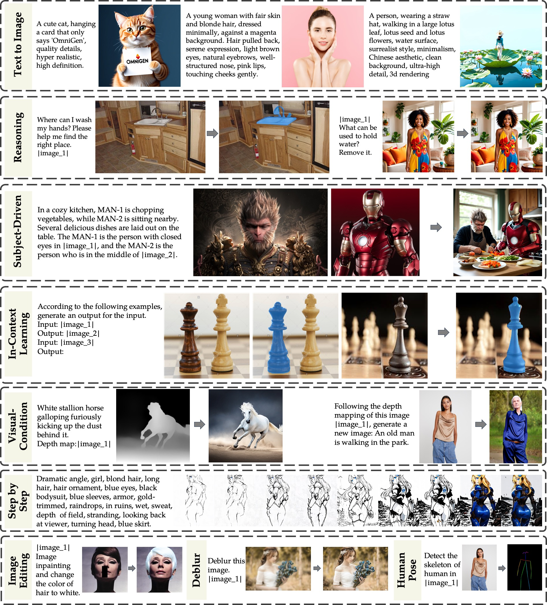

<h1 align="center">OmniGen: Unified Image Generation</h1>


<p align="center">
    <a href="">
        
    </a>
    <a href="https://arxiv.org/abs/2409.11340">
            
    </a>
    <a href="https://huggingface.co/spaces/Shitao/OmniGen">
        
    </a>
    <a href="https://huggingface.co/C-MTEB">
        
    </a>
    <a href="https://huggingface.co/Shitao/OmniGen-v1">
        
    </a>
</p>

<h4 align="center">
    <p>
        <a href=#Overview>Overview</a> |
        <a href=#news>News</a> |
        <a href=#methodology>Methodology</a> |
        <a href=#quick-start>Quick Start</a> |
        <a href=#gradio-demo>Gradio Demo</a> |
        <a href="#finetune">Finetune</a> |
        <a href="#license">License</a> |
        <a href="#citation">Citation</a> |
        <a href="https://huggingface.co/Shitao/OmniGen-v1">Model Weight</a>
    <p>
</h4>


## 1. Overview

OmniGen is a unified image generation model that can generate a wide range of images from multi-modal prompts. It is designed to be simple, easy to use, and flexible. We provide [inference code](inference.ipynb) so you can explore more functionalities of OmniGen.
Existing image generation models require loading many additional network modules (such as ControlNet, IP-Adapter, Reference-Net) and extra preprocessing steps (e.g., face detection, pose detection, image cropping) to generate a satisfactory image.
We believe that future image generation models should be simpler, generating various images directly through instructions, similar to how GPT works in language generation.

Due to current limitations in resources and data, OmniGen still has room for improvement. We will continue to optimize the model. You can also choose to fine-tune the model for specific tasks. Fine-tuning OmniGen is very simple: you don't need to worry about designing a network structure for a specific task; you just need to prepare the corresponding data, and then run the [script](docs/fine-tuning.md). Imagination is no longer limited; you can construct any image generation task, and perhaps we can achieve some very interesting things.

If you have any questions or interesting tasks you want OmniGen to accomplish, feel free to discuss with us: 2906698981@qq.com.


## 2. News
- 2024-10-22: We release the code for OmniGen. Inference: [docs/inference.md](docs/inference.md) Train: [docs/fine-tuning.md](docs/fine-tuning.md) :fire:
- 2024-10-22: We release the first version of OmniGen. Model weight: [Shitao/OmniGen-v1](https://huggingface.co/Shitao/OmniGen-v1)  HF Demo: [🤗](https://huggingface.co/spaces/Shitao/OmniGen)  :fire:


## 3. Methodology

You can see details in our [paper](https://arxiv.org/abs/2409.11340). 



## 4. Quick Start


### Using OmniGen
Install:
```bash
git clone https://github.com/staoxiao/OmniGen.git
cd OmniGen
pip install -e .
```


You can see our examples in [inference.ipynb](inference.ipynb) to generate images. 
Here are some simple examples:
```python
from OmniGen import OmniGenPipeline

pipe = OmniGenPipeline.from_pretrained("Shitao/tmp-preview")

# Text to Image
images = pipe(
    prompt="A woman holds a bouquet of flowers and faces the camera", 
    height=1024, 
    width=1024, 
    guidance_scale=3
    )
images[0].save("t2i.png")

# Multi-modal to Image
# In prompt, we use the placeholder to represent the image. The image placeholder should be in the format of <|image_*|></img>
# You can add multiple images in the input_images. Please ensure that each image has its placeholder. For example, for the list input_images [img1_path, img2_path], the prompt needs to have two placeholders: <|image_1|></img>, <|image_2|></img>.
images = pipe(
    prompt="A woman holds a bouquet of flowers and faces the camera. Thw woman is <|image_1|></img>.", 
    input_images=["./imgs/test_cases/liuyifei.png"], 
    height=1024, 
    width=1024,
    guidance_scale=3, 
    img_guidance_scale=1.6)
images[0].save("ti2i.png")
```
For more details about inference, please refer to [docs/inference.md](docs/inference.md).


### Using Diffusers
Coming soon.


## 5. Gradio Demo

We have constructed a online demo in [Huggingface](https://huggingface.co/spaces/Shitao/OmniGen).

For the local gradio demo, you can run with the following command:
```python
python app.py
```


## 6. Finetune
We provide a train scrip `train.py` to fine-tune OmniGen. Please refer to [docs/finetune.md](docs/finetune.md) for more details.


## License
This repo is licensed under the [MIT License](LICENSE). 


## Citation

```
@article{xiao2024omnigen,
  title={Omnigen: Unified image generation},
  author={Xiao, Shitao and Wang, Yueze and Zhou, Junjie and Yuan, Huaying and Xing, Xingrun and Yan, Ruiran and Wang, Shuting and Huang, Tiejun and Liu, Zheng},
  journal={arXiv preprint arXiv:2409.11340},
  year={2024}
}
```


